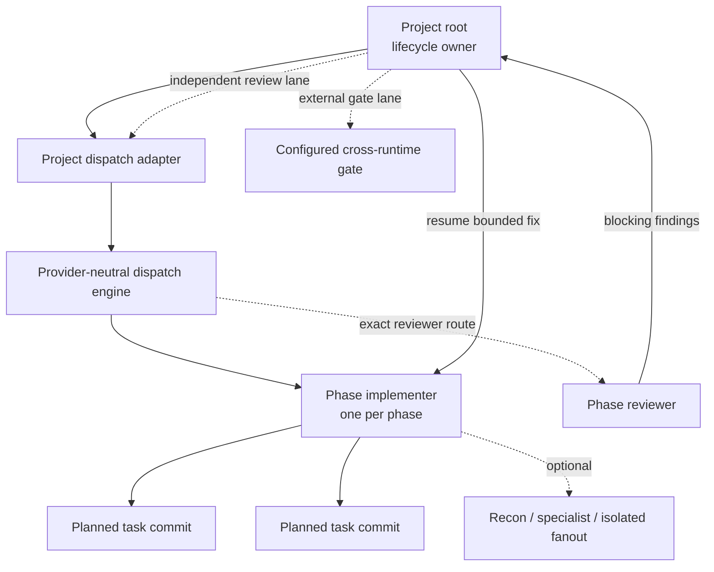
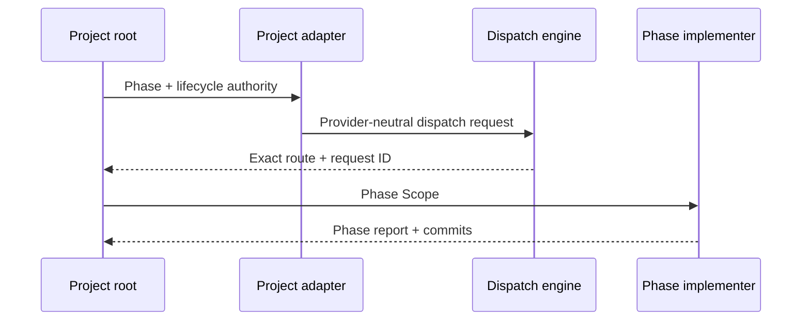

# Orchestration Model

OAT separates lifecycle ownership from implementation ownership:

- the project root owns sequencing, reviews, fix routing, checkpoints, fan-in,
  and bookkeeping;
- one phase implementer owns all planned tasks for one phase; and
- optional nested agents provide bounded help only when useful.

This topology keeps model control at the meaningful phase boundary without
making every task pay another dispatch and context-loading round.

## Default Topology

The solid implementation lane is mandatory. The dotted nested lane is
benefit-driven. A run does not fail merely because the phase agent cannot or
does not launch a third tier.

## Role Boundaries

| Role                  | Generic class       | Owns                                                                                      | Must not                                                                                       |
| --------------------- | ------------------- | ----------------------------------------------------------------------------------------- | ---------------------------------------------------------------------------------------------- |
| Project root          | lifecycle caller    | Phase schedule, dispatch policy, phase review, fixes, worktrees, checkpoints, bookkeeping | Take over an accepted child scope or silently replace an accepted launch                       |
| Phase implementer     | `worker`            | One whole phase, ordered task execution, per-task commits, phase verification             | Dispatch the phase reviewer, alter plan sequencing, own project checkpoints                    |
| Optional nested child | `worker` or `recon` | Explicit bounded objective, files/read scope, output, verification                        | Become mandatory for ordinary tasks, widen phase authority, commit in place of the phase agent |
| Phase reviewer        | `reviewer`          | Independent review of one phase commit range                                              | Inherit a below-ceiling producer silently or mutate implementation                             |
| External gate         | `reviewer`          | Configured producer-independent lifecycle decision                                        | Substitute same-context self-review when independence is required                              |

## Dispatch Layers

Every lifecycle launch flows through two contracts:

1. `oat-project-dispatch-subagents` resolves project state, role policy,
   ceilings, scope, files, commits, worktrees, and checkpoints.
2. `oat-dispatch-subagents` resolves capabilities, catalogs, exact routes,
   launch acceptance, continuation, and generic evidence.

The lifecycle workflow remains authoritative for synthesis and state mutation.
The dispatch engine does not edit `plan.md`, `implementation.md`, or project
state.

## Phase Execution

The phase implementer reads its artifact set once and executes tasks serially in
plan order. Each task retains its file boundary, verification, and one-commit
contract. The phase agent self-checks before committing and runs phase-wide
verification before returning.

The root verifies the report against Git rather than trusting child prose:

- phase base and final HEAD;
- one commit per planned task;
- declared file boundaries;
- task and phase verification;
- clean worktree; and
- optional child records, if any.

See [Implementation Execution](implementation-execution.md) for the executable
contract.

## Independent Phase Review

After a phase report is accepted, the root resolves and launches the reviewer
at the configured review ceiling. Review ownership does not sit inside a
possibly below-ceiling phase agent.

Blocking findings return to the original phase handle in fix mode. If that
completed handle cannot resume, one fresh same-target phase agent may receive
the bounded fix scope, with `continuation_events` linking the new request to the
original `request_id`.

This preserves continuity without allowing replacement after an accepted failed
launch.

## Optional Third Tier

Nested work is appropriate when the work itself benefits:

- read-only reconnaissance that can run independently;
- analysis fanout across separate concerns;
- safely isolated implementation lanes; or
- a specialist capability the phase agent does not provide efficiently.

Before launch, the phase agent defines objective, authority, exact target,
output, verification, deadline, retry policy, and fallback. The parent retains
phase ownership and task commit authority.

Do not use nested dispatch merely to mirror task granularity. The default
five-task smoke fixture intentionally proves successful execution with no task
workers.

## Catalogs and Exact Selection

Native model catalogs are per-dispatch-context snapshots. A root catalog does
not prove what a nested agent can launch, and a provider CLI catalog does not
prove native eligibility.

The full-information selection order is:

1. inspect the current dispatch context's native catalog;
2. intersect it with configured candidates under the named ceiling;
3. prefer a satisfying exact native route;
4. otherwise select a policy-authorized CLI/programmatic route before launch;
5. record the reason and ordered candidates; and
6. fail closed if no exact authorized route exists.

Configured values remain opaque where the provider defines them that way.
Never infer capabilities from Cursor selector spelling.

## Accepted-Launch Terminality

Pre-start rejection and accepted child failure are different states:

- **Pre-start rejection:** no child owns the scope; another configured route may
  be selected.
- **Accepted launch:** the child owns the scope; its completed, failed,
  interrupted, timed-out, or `BLOCKED` result is authoritative.

`invalid-run-abort` is cancellation of a proven-invalid run, not a child outcome
and not permission to launch a replacement.

## Parallel Phases

Plan-declared phase groups run in separate worktrees. The root creates and
registers worktrees, verifies the common base, dispatches one phase implementer
per worktree, owns each review/fix loop, then merges passing phases in plan
order.

Task-level concurrency inside one worktree remains disallowed unless an
optional child has explicitly isolated write authority.

## Provider Shapes

- **Codex:** root uses the exact materialized phase implementer and reviewer
  roles. Depth one supports the default topology; depth two enables optional
  nested work.
- **Claude:** root uses native Agent dispatch for phase implementation and
  review. Nested Agent work is optional and evidenced per run.
- **Cursor IDE:** operator starts the root session. Native and CLI routes use
  full-information selection, with deliberate pre-start CLI choice when the
  native catalog is unsatisfying.
- **Cursor CLI:** treated as a separate harness with its own catalog and event
  evidence.

## Related

- [Implementation Execution](implementation-execution.md)
- [Dispatch Policy](dispatch-ceiling.md)
- [Review Flavors](review-flavors.md)
- [Programmatic Execution](programmatic-execution.md)
- [Evidence Layers](evidence-layers.md)
- [Workflow Smoke Testing](../../contributing/smoke-testing.md)
