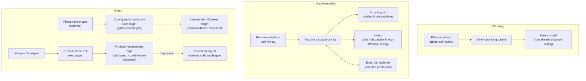

# Review Flavors

OAT projects run reviews at several different lifecycle points, and those points
have different independence requirements. A self-review that checks a freshly
written plan does not need the same producer isolation as a lifecycle gate that
signs off on the final artifact. Rather than force one reviewer-selection rule
onto every point, OAT recognizes **four review flavors**, each with its own
target-resolution policy layered on the shared reviewer role class.

The distinguishing question is always _"who resolves this review's target, and
how independent must that target be from whatever produced the work?"_ The four
flavors answer it differently while preserving one invariant: the reviewer runs
**at or above the ceiling** (see [Dispatch Policy](dispatch-ceiling.md)). Gate
independence is project policy layered on the generic reviewer role class
described in the `oat-project-dispatch-subagents` lifecycle-role table; this page
covers _which_ flavor fires _when_ and _who_ resolves its target, and links out
for the deep review request/receive mechanics.

## Quick Look

- What it does: names the four review flavors and states who resolves each
  one's reviewer target.
- When to use it: when you need to know which review fires at a lifecycle point
  and whether it inherits, pins the ceiling, or requires an independent gate.
- Primary sources: `oat-project-implement` phase-execution mechanics, the
  `oat-project-dispatch-subagents` lifecycle-role table, and project design
  Decision #11.

## Flow map

The dotted branch marks the only flavor that may **spawn a nested managed
reviewer child** inside the gate exec target: the lifecycle/final gate.

## The four flavors

| Flavor                              | Lifecycle point                                                    | Target resolution                                                                                                                                                                                              |
| ----------------------------------- | ------------------------------------------------------------------ | -------------------------------------------------------------------------------------------------------------------------------------------------------------------------------------------------------------- |
| Planning-phase artifact self-review | Auto artifact-review loop for plan/spec/design                     | Inherit the planning parent by default (root is already at/above ceiling)                                                                                                                                      |
| Implementation-phase self-review    | Phase and final code reviews dispatched by `oat-project-implement` | Resolve the dispatch ceiling; pin the ceiling's final candidate (at-ceiling pin); inherit only when the review-owning dispatcher is known to be at/above ceiling; else select an exact CLI reviewer pre-launch |
| Phase review gate (external)        | Optional non-pausing gate after a phase passes its self-review     | Independent configured cross-family CLI/exec target (`gates.execTargets`), host-avoidance, unconstrained by native catalog; fail closed if unavailable                                                         |
| Lifecycle / final gate              | End-of-lifecycle sign-off                                          | Cross-runtime CLI exec target, independent of producer context; fails closed rather than substituting same-context self-review; may spawn a nested managed reviewer child inside the gate exec target          |

The first two flavors are **self-reviews**. Planning review inherits its
producing parent by default; implementation phase review is dispatched by the
project root after the phase producer returns. The last two are **gates** — an
external, configured, producer-independent target. Phase implementation may run
_below_ the review ceiling for cost reasons, but review must never silently
inherit the below-ceiling phase agent.

Pre-plan inheritance has a narrow executable guard. When dispatch resolution
reports `unresolvedReason: policy`, an artifact review of `discovery`, `design`,
or `spec` deliberately inherits the current planning context and records
`selection_reason: inherit (pre-plan; no project policy)`. An explicit project
policy is still honored at those scopes. Missing or incomplete ladders
(`unresolvedReason: ladder | both`) fail closed, as do plan-scope artifact
reviews and every code review without a resolved policy. Gate exec-target
selection is separate and unaffected.

## Independence and fail-closed semantics

The invariant across all four flavors is that the reviewer runs **at or above
the ceiling**. What changes between flavors is the required _independence from
the producer_, and that independence is enforced by failing closed rather than
silently downgrading:

- **Planning self-review** needs the least independence. The planning root
  already runs at or above the review ceiling, so inheriting the parent model
  satisfies the invariant without managed re-pinning. Pinning is _possible_
  once the ceiling is resolved during planning, but it is not the default.
- **Implementation self-review** needs ceiling-level capability but not
  cross-family isolation. The root resolves the dispatch ceiling and pins the
  tier's final candidate after the phase report. Inheritance is allowed only
  when the root dispatcher is _known_ to be at or above the ceiling; otherwise
  an exact provider CLI reviewer is selected before launch. Reviewer selection
  is never delegated to the phase implementer.
- **Phase review gate** adds cross-family independence. It uses a configured
  independent exec target from `gates.execTargets` with host-avoidance,
  unconstrained by the harness's native subagent catalog. If the required
  independent target cannot be enforced, the gate **fails closed** — it does
  not downgrade to producer-context review.
- **Lifecycle / final gate** requires the strongest independence: a
  cross-runtime CLI exec target chosen independently of the producer context.
  It fails closed rather than substituting a same-context self-review, and it is
  the one flavor permitted to spawn a nested managed reviewer child _inside_ the
  gate exec target when the gate's own contract calls for it.

Gate independence is not a property of the generic reviewer class; it is project
policy layered on top of it. The dispatch adapter resolves the configured gate
target before launch and passes it as exact selection input. Fail-closed
behavior for both gate flavors is deliberate: an unavailable independent target
blocks the gate instead of quietly reusing whatever produced the work. For the
gate configuration keys and non-pausing behavior, see
[Workflow gates](../../cli-utilities/workflow-gates.md) and the
[phase review gate](reviews.md#phase-review-gate) section of the review doc.

## Related

- [Reviews](reviews.md) — the review request/receive flows and the deep review
  contract these flavors plug into.
- [Dispatch Policy](dispatch-ceiling.md) — named ceilings, at-ceiling reviewer
  selection, and the Dispatch Report V1 / producer-provenance record.
- [HiLL Checkpoints](hill-checkpoints.md) — how the non-pausing phase review gate
  relates to pauseable lifecycle checkpoints.
- [Orchestration Model](orchestration-model.md) — the native-first dispatch
  topology these reviewer roles run inside.
- [Workflow gates](../../cli-utilities/workflow-gates.md) — gate configuration
  and exec-target selection.
- [Smoke testing](../../contributing/smoke-testing.md) — how the fixture makes
  these flavors observable and assertable.
