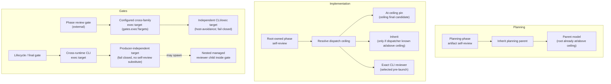

# Review Flavors

OAT projects run reviews at several different lifecycle points, and those points
have different independence requirements. A self-review that checks a freshly
written plan does not need the same producer isolation as a lifecycle gate that
signs off on the final artifact. Rather than force one reviewer-selection rule
onto every point, OAT recognizes **four review flavors**, each with its own
target-resolution policy layered on the shared reviewer role class.

The distinguishing question is always _"who resolves this review's target, and
how independent must that target be from whatever produced the work?"_ The four
flavors answer it differently while preserving one invariant: the reviewer runs
**at or above the ceiling** (see [Dispatch Policy](../../advanced/dispatch-ceiling.md)). Gate
independence is project policy layered on the generic reviewer role class
described in the `oat-project-dispatch-subagents` lifecycle-role table; this page
covers _which_ flavor fires _when_ and _who_ resolves its target, and links out
for the deep review request/receive mechanics.

## Quick Look

- What it does: names the four review flavors and states who resolves each
  one's reviewer target.
- When to use it: when you need to know which review fires at a lifecycle point
  and whether it inherits, pins the ceiling, or requires an independent gate.
- Primary sources: `oat-project-implement` phase-execution mechanics, the
  `oat-project-dispatch-subagents` lifecycle-role table, and project design
  Decision #11.

## Flow map



The dotted branch marks the only flavor that may **spawn a nested managed
reviewer child** inside the gate exec target: the lifecycle/final gate.

## The four flavors

| Flavor                              | Lifecycle point                                                    | Target resolution                                                                                                                                                                                              |
| ----------------------------------- | ------------------------------------------------------------------ | -------------------------------------------------------------------------------------------------------------------------------------------------------------------------------------------------------------- |
| Planning-phase artifact self-review | Auto artifact-review loop for plan/spec/design                     | Inherit the planning parent by default (root is already at/above ceiling)                                                                                                                                      |
| Implementation-phase self-review    | Phase and final code reviews dispatched by `oat-project-implement` | Resolve the dispatch ceiling; pin the ceiling's final candidate (at-ceiling pin); inherit only when the review-owning dispatcher is known to be at/above ceiling; else select an exact CLI reviewer pre-launch |
| Phase review gate (external)        | Optional non-pausing gate after a phase passes its self-review     | Independent configured cross-family CLI/exec target (`gates.execTargets`), host-avoidance, unconstrained by native catalog; fail closed if unavailable                                                         |
| Lifecycle / final gate              | End-of-lifecycle sign-off                                          | Cross-runtime CLI exec target, independent of producer context; fails closed rather than substituting same-context self-review; may spawn a nested managed reviewer child inside the gate exec target          |

The first two flavors are **self-reviews**. Planning review inherits its
producing parent by default; implementation phase review is dispatched by the
project root after the phase producer returns. The last two are **gates** — an
external, configured, producer-independent target. Phase implementation may run
_below_ the review ceiling for cost reasons, but review must never silently
inherit the below-ceiling phase agent.

Pre-plan inheritance has a narrow executable guard. When dispatch resolution
reports `unresolvedReason: policy`, an artifact review of `discovery`, `design`,
or `spec` deliberately inherits the current planning context and records
`selection_reason: inherit (pre-plan; no project policy)`. An explicit project
policy is still honored at those scopes. Missing or incomplete ladders
(`unresolvedReason: ladder | both`) fail closed, as do plan-scope artifact
reviews and every code review without a resolved policy. Gate exec-target
selection is separate and unaffected.

## Independence and fail-closed semantics

The invariant across all four flavors is that the reviewer runs **at or above
the ceiling**. What changes between flavors is the required _independence from
the producer_, and that independence is enforced by failing closed rather than
silently downgrading:

- **Planning self-review** needs the least independence. The planning root
  already runs at or above the review ceiling, so inheriting the parent model
  satisfies the invariant without managed re-pinning. Pinning is _possible_
  once the ceiling is resolved during planning, but it is not the default.
- **Implementation self-review** needs ceiling-level capability but not
  cross-family isolation. The root resolves the dispatch ceiling and pins the
  tier's final candidate after the phase report. Inheritance is allowed only
  when the root dispatcher is _known_ to be at or above the ceiling; otherwise
  an exact provider CLI reviewer is selected before launch. Reviewer selection
  is never delegated to the phase implementer.
- **Phase review gate** adds cross-family independence. It uses a configured
  independent exec target from `gates.execTargets` with host-avoidance,
  unconstrained by the harness's native subagent catalog. If the required
  independent target cannot be enforced, the gate **fails closed** — it does
  not downgrade to producer-context review.
- **Lifecycle / final gate** requires the strongest independence: a
  cross-runtime CLI exec target chosen independently of the producer context.
  It fails closed rather than substituting a same-context self-review, and it is
  the one flavor permitted to spawn a nested managed reviewer child _inside_ the
  gate exec target when the gate's own contract calls for it.

Gate independence is not a property of the generic reviewer class; it is project
policy layered on top of it. The dispatch adapter resolves the configured gate
target before launch and passes it as exact selection input. Fail-closed
behavior for both gate flavors is deliberate: an unavailable independent target
blocks the gate instead of quietly reusing whatever produced the work. For the
gate configuration keys and non-pausing behavior, see
[Workflow gates](../../advanced/workflow-gates.md) and the
[phase review gate](index.md#phase-review-gate) section of the review doc.

## Related

- [Reviews](index.md) — the review request/receive flows and the deep review
  contract these flavors plug into.
- [Dispatch Policy](../../advanced/dispatch-ceiling.md) — named ceilings, at-ceiling reviewer
  selection, and the Dispatch Report V1 / producer-provenance record.
- [HiLL Checkpoints](../planning/hill-checkpoints.md) — how the non-pausing phase review gate
  relates to pauseable lifecycle checkpoints.
- [Orchestration Model](../../advanced/orchestration-model.md) — the native-first dispatch
  topology these reviewer roles run inside.
- [Workflow gates](../../advanced/workflow-gates.md) — gate configuration
  and exec-target selection.
- [Smoke testing](../../../contributing/smoke-testing.md) — how the fixture makes
  these flavors observable and assertable.

## Choosing a Review Skill

The four lifecycle flavors above describe reviewer selection and independence.
The eight skills below answer a different question: **where is the review,
and where should its findings go?**

- **Provide** examines work and produces findings; **receive** triages findings
  that already exist.
- **Ad-hoc** produces standalone findings or tasks without changing project
  lifecycle artifacts; **project** uses the project's requirements, plan and
  review ledger.
- **Local** exchanges Markdown review artifacts; **remote** exchanges GitHub
  PR reviews and comments. “Remote” describes the exchange, not a requirement
  to own a second physical machine.

| You want to                             | Ad-hoc                      | Project-scoped                      |
| --------------------------------------- | --------------------------- | ----------------------------------- |
| Review local work                       | `oat-review-provide`        | `oat-project-review-provide`        |
| Triage a local review                   | `oat-review-receive`        | `oat-project-review-receive`        |
| Review and post findings on a GitHub PR | `oat-review-provide-remote` | `oat-project-review-provide-remote` |
| Triage GitHub feedback                  | `oat-review-receive-remote` | `oat-project-review-receive-remote` |

A project-required review does not always require a previously active pointer:
project provide can resolve an explicitly named project, and remote project
provide can resolve it from the PR or `--project`. Remote project **receive**
currently requires a valid active project with its tracking artifacts; select
it before receiving. Do not infer one variant's prerequisites from its twin.

All variants use Critical, High, Medium and Low severities. A reviewer reports
the issue; receive establishes its disposition. Remote posting, replies and
any optional ad-hoc remote fix-and-push flow have separate approval boundaries.
Examples below are agent skill invocations, not terminal `oat` subcommands.

## oat-review-provide

Review a bounded set of local changes without creating or resuming an OAT
project. Scope can be unstaged changes, staged changes, an explicit file list
or a commit range.

**Invocation:**

```text
/oat-review-provide staged
```

If you omit scope, the skill asks what to review and recommends unstaged work
for an in-progress review. It shows the resolved scope for confirmation.

**Prerequisites:** The selected files or changes must be available locally.
No existing project or active pointer is required. Agree whether findings
should be local-only, tracked or inline; these are output policies, not
different code-review scopes.

**Example scenario:** You staged a small callback fix that does not warrant a
tracked project. Use the ad-hoc local provide variant to review precisely that
staged diff. The reviewer can flag a missing input check without interpreting
the change as fulfillment of a project plan.

**Expected output:** Findings with severity, file locations and verification
guidance, plus the reviewed scope and artifact location or an explicit
inline-only result. File output defaults to local active orphan-review storage
unless the repository's tracked review convention applies; new findings are
not written directly into an archive.

**Next step:** Pass the active artifact to ad-hoc review-receive for triage.
If you chose inline-only output, request a file artifact when you need that
later artifact-based handoff. Reviewing does not implement the fixes; committing
a tracked review artifact is an explicit bookkeeping choice.

## oat-review-receive

Turn an existing local review into standalone tasks, preserving explicit
decisions about what will be fixed, deferred or dismissed.

**Invocation:**

```text
/oat-review-receive
```

An explicit review-artifact path can select the input. Without one, the skill
discovers active artifacts under repository-review and local orphan-review
storage, orders candidates by their recorded generation time and reports which
it selected. Archived artifacts are history, not default triage inputs.

**Prerequisites:** A readable, nonempty Markdown review artifact exists. No
project is required, and this rail does not mutate `plan.md`, `state.md` or
`implementation.md`.

**Example scenario:** The callback review has one High finding and a Low
cleanup note. Receive shows both before asking for dispositions. You convert
the missing input check into a task and either convert the cleanup or explain
why it should be deferred. Use this local ad-hoc variant because the input is
a Markdown artifact and the output should remain outside project tracking.

**Expected output:** Severity counts, converted/deferred/dismissed decisions
with rationale, and a standalone task list inline or at a requested path.
After triage, the consumed artifact moves to its sibling archive and the
archived location is reported. A zero-findings review reports a clean result
and stops.

**Next step:** Implement the accepted tasks through your chosen development
flow, then request another review if needed. This receive skill does not
change code or silently start implementation.

## oat-review-provide-remote

Review a GitHub PR and post its findings without using project lifecycle
context. The GitHub review, rather than a local Markdown artifact on the
reviewing machine, is the handoff to the author.

**Invocation:**

```text
/oat-review-provide-remote --pr 84
```

**Prerequisites:** The PR is reachable through the current repository remote,
and `gh` is installed and authenticated. No OAT project is required. Confirm
the selected PR, and separately approve the review body before posting it.

**Example scenario:** A teammate opened PR 84 for the standalone callback fix.
Use remote ad-hoc provide so the findings arrive on that PR, even though the
reviewer has no active project. The skill normally acquires a temporary
worktree for context rather than changing the caller's checkout. Diff-only
mode is available with `--no-checkout`, with a degraded-context warning.

**Expected output:** A single approved GitHub review containing severity
counts, inline findings where the diff supports them and body findings for
locations outside the diff. The report identifies the reviewed PR head,
scope and posting result. Critical or High findings produce
`REQUEST_CHANGES`; otherwise the verdict is `COMMENT`, not automatic approval.
No local review artifact, implementation commit or project bookkeeping is
created by this variant.

**Next step:** On the author's side, use ad-hoc remote receive to triage the
comments. For re-review, guarded prior-review metadata may narrow the scope;
if no valid prior review is available, the normal path reviews the full PR.
A failed post is not a delivered review: follow the reported diagnosis.

## oat-review-receive-remote

Fetch unresolved GitHub review feedback and turn it into standalone tasks.
This is the receiving half of the remote ad-hoc flow.

**Invocation:**

```text
/oat-review-receive-remote --pr 84
```

**Prerequisites:** `npx agent-reviews` is available and GitHub authentication
is configured. No project is required. The selected PR is confirmed before
comment ingestion.

**Example scenario:** PR 84 now has the callback finding from remote provide
and a separate reviewer comment about an edge case. Use remote ad-hoc receive
to gather the unresolved feedback, classify the actual issues and decide what
to convert. This variant is appropriate because the source is GitHub and the
accepted work should become standalone tasks, not project task IDs.

**Expected output:** A finding register and task list, with severity and
converted/deferred/dismissed counts. No unresolved comments produces a clean
status and stops. Deferrals and dismissals need concrete rationale, including
for Low findings; a GitHub changes-requested state is evidence to inspect,
not an automatic severity assignment for every comment.

**Next step:** Decide whether to implement the tasks yourself or authorize the
skill's optional fix, verification, commit and push flow. That flow requires
explicit confirmation after the task list. Posting replies is another explicit
choice, and replies distinguish fixed work from merely acknowledged tasks.
Neither optional action changes project lifecycle artifacts on this ad-hoc rail.

## oat-project-review-provide

Review project work against the requirements and artifacts appropriate to its
workflow mode. Use this when the question is not only “is the code sound?” but
also “does this work satisfy the agreed plan?”

**Invocation:**

```text
/oat-project-review-provide code p02
```

Code scope can select a task, phase, contiguous phase range or final review.
Artifact review selects an artifact instead, for example
`/oat-project-review-provide artifact plan`. Without arguments, the skill
proposes or asks for type and scope, then confirms a manual review.

**Prerequisites:** An initialized project must resolve from the active pointer
or an explicitly supplied project/review target. Its core artifacts must be
committed before review. Code review needs completed implementation work and
the mode-appropriate requirements sources; lite review does not require absent
discovery, spec or design artifacts.

**Example scenario:** Checkout-hardening has finished phase p02, including
caller updates. Request a local project code review of p02 to check those
changes against the plan and implementation evidence, not just an arbitrary
branch diff. If the project is not active, name its path or project explicitly
when asking for the review rather than switching to the ad-hoc rail by accident.

**Expected output:** A scoped review artifact in the project's active
`reviews/` directory, with requirements alignment, findings, verification
guidance and a next-step recommendation. The workflow records the review
event and persists its bookkeeping. An explicitly selected inline-only flow
does not create the ordinary artifact. A blocked reviewer is not a passed
review with zero findings.

**Next step:** Use project review-receive for the active artifact. If findings
identify stale requirements artifacts rather than a code defect, preserve that
distinction during triage; do not automatically change defensible code to match
an outdated description.

## oat-project-review-receive

Process an actionable local project review and reconnect its findings to the
project's execution or artifact-editing flow.

**Invocation:**

```text
/oat-project-review-receive
```

**Prerequisites:** A valid project and an active project review must resolve.
The normal input is an actionable artifact in the top level of its `reviews/`
directory. A named project can supply the target even without an active
pointer. Historical archived reviews are not automatically received again;
discovery of an ad-hoc review routes to the ad-hoc receive skill instead.

**Example scenario:** The p02 reviewer found a missed caller and a stale plan
statement. Project receive explains the findings before disposition. For a
manual code review, accepted fixes become stable review-fix task IDs in the
plan; for an artifact review, approved changes are applied directly to the
artifact rather than pretending they are implementation tasks. Use the project
local variant because the input is a local project review event and its
dispositions belong in the project ledger.

**Expected output:** Finding analysis and dispositions, updated project
tracking and an archived consumed review artifact with collision-safe identity.
The outcome reports added tasks or artifact dispositions and the next route.
Automatic and gate-originated reviews have their own disposition rules; a
passing gate's sub-threshold findings are still recorded, not silently erased.

**Next step:** Review any added tasks, then run implementation when ready, or
choose its offered execution handoff. For artifact-review changes, request a
new artifact review or follow the phase's approval flow. Final review also
resurfaces deferred Medium findings; receiving one phase review does not
automatically close the project.

## oat-project-review-provide-remote

Review a project's GitHub PR using its requirements context, then post findings
back without writing project tracking on the reviewing machine.

**Invocation:**

```text
/oat-project-review-provide-remote code p02 --pr 84 --project .oat/projects/shared/checkout-hardening
```

**Prerequisites:** The PR is reachable and `gh` is installed and authenticated.
An existing project must resolve from exactly one project's `state.md` in the
PR diff or from the explicit `--project` path. The override is needed when the
diff identifies zero or multiple projects. Its artifacts must be available
for mode-aware review. A local active-project pointer is not required.

**Example scenario:** The checkout-hardening author asks another workstation
to review phase p02 on PR 84. That reviewer has no active project, and the PR
also touches an unrelated project's state. Use remote project provide with the
explicit project path so the review checks checkout-hardening's plan and posts
findings tagged for that project and scope, rather than mixing the two projects
or producing an ad-hoc review.

**Expected output:** After explicit posting approval, one GitHub review with
project and scope metadata, severity counts, supported inline findings and a
report of the PR head reviewed. The reviewing checkout is preserved through
temporary-worktree acquisition or the declared diff-only fallback. The skill
writes no local review artifact and makes no project bookkeeping, fixes,
commits or pushes on the reviewing machine. Its verdict is `REQUEST_CHANGES`
for Critical/High findings and `COMMENT` otherwise.

**Next step:** On the originating checkout, select the project and run project
remote receive. A re-review can narrow only against guarded prior metadata for
the same project, scope and invocation lineage; an unrelated project's review
must not become the baseline.

## oat-project-review-receive-remote

Bring unresolved GitHub review feedback into an existing project's task and
review ledger. Unlike ad-hoc remote receive, this skill does not directly
implement code fixes.

**Invocation:**

```text
/oat-project-open checkout-hardening
/oat-project-review-receive-remote --pr 84
```

**Prerequisites:** The active project is valid and has `plan.md`,
`implementation.md` and `state.md`. `npx agent-reviews` is available and GitHub
authentication is configured. Confirm the selected PR; the reviewing machine's
ability to infer a project does not remove this receiving variant's active
project requirement.

**Example scenario:** The remote p02 review on PR 84 identified a missing
caller check. Back in the authoring checkout, open checkout-hardening and
receive that PR's unresolved feedback. The agent presents the finding and
creates a stable review-fix task in the correct project, keeping later
implementation and re-review connected to the same event.

**Expected output:** Findings and dispositions, created `pNN-tNN` task IDs when
needed, an event-distinct review artifact and consistent plan, implementation
and state bookkeeping. Review cycles are bounded; reaching the receive-cycle
limit requests direction rather than silently repeating ingestion. Optional
GitHub replies require explicit approval and describe the actual disposition.

**Next step:** Run implementation for added fix tasks, then request re-review
of the relevant scope. If no tasks were needed and the review passed, follow
the reported finalization route. Receiving feedback is not itself proof that
the changes were fixed, verified, pushed or approved for merge.
