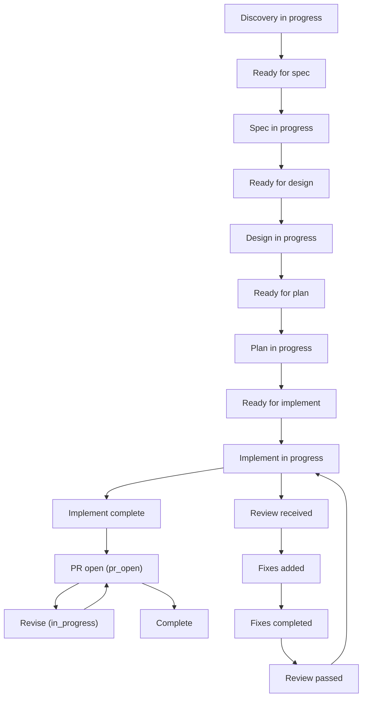

# State Machine

This page is the compact contract for how project lifecycle state and review state advance across a tracked OAT project.

## Quick Look

- What it does: defines the allowed lifecycle and review-state transitions recorded in `state.md` and `plan.md`.
- When to use it: when you need to debug lifecycle routing, review posture, or why a project is not advancing to the next phase.
- Primary artifacts: `state.md`, `plan.md`, `implementation.md`

## State Transition Map

## Phase status values

`oat_phase_status` in `state.md`:

- `in_progress` — phase is actively being worked on
- `complete` — phase is finished
- `pr_open` — post-PR review posture. Set by `oat-project-pr-final`. Agents should route to `oat-project-revise` (for feedback) or `oat-project-complete` (when approved).

`pr_open` is not the source of truth for actual PR existence. That is tracked separately in `state.md` via:

- `oat_pr_status` — PR lifecycle state (`ready`, `open`, `closed`, `merged`)
- `oat_pr_url` — tracked PR URL when a PR exists

## Lifecycle progression

Typical progression:

1. Discovery in progress
2. Ready for spec
3. Spec in progress
4. Ready for design
5. Design in progress
6. Ready for plan
7. Plan in progress
8. Ready for implement
9. Implement in progress
10. Implement complete (final review passed)
11. PR open (`pr_open`) — post-PR review posture; actual PR existence is tracked via `oat_pr_status` / `oat_pr_url`
12. Revision loop (optional): `pr_open` → revise → `in_progress` → implement → `pr_open`
13. Complete

## Review progression

In `plan.md` Reviews table:

- `pending` -> `received` -> `fixes_added` -> `fixes_completed` -> `passed`

## Guardrail

Do not move to the next lifecycle state if review/state artifacts indicate unresolved gates.

## Reference artifacts

- `.oat/projects/<scope>/<project>/state.md`
- `.oat/projects/<scope>/<project>/plan.md` (`## Reviews`)
- `.oat/projects/<scope>/<project>/implementation.md`
