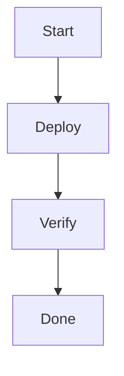

# Deployment Guide

This guide covers deploying your application.

> [!NOTE] Prerequisites
> You need the following installed:
>
> - Node.js 20+
> - Docker

> [!WARNING]
> Make sure to back up your database before proceeding.

> [!TIP] Quick Start
> Run `docker compose up` to get started quickly.
>
> This will start all required services.

> [!NOTE] Advanced Configuration
> You can configure the following environment variables:
>
> - `DB_HOST` — database host
> - `DB_PORT` — database port
> - `DB_NAME` — database name

> [!CAUTION] Data Loss Warning
> Running this command will **permanently delete** all data.
>
> ```bash
> oat cleanup --force
> ```
>
> There is no undo.

> [!TIP]
> Your deployment is complete!

## Mermaid Diagram



## Code Example

```typescript
const config = {
  host: 'localhost',
  port: 3000,
};
```
